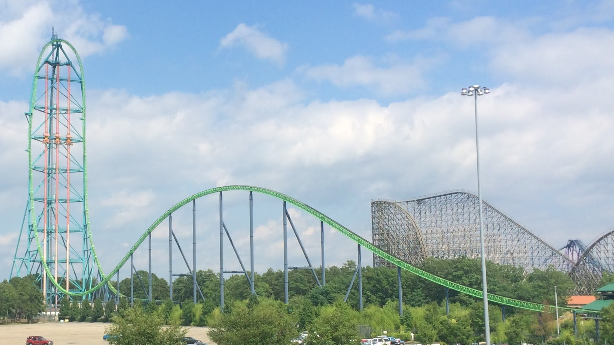
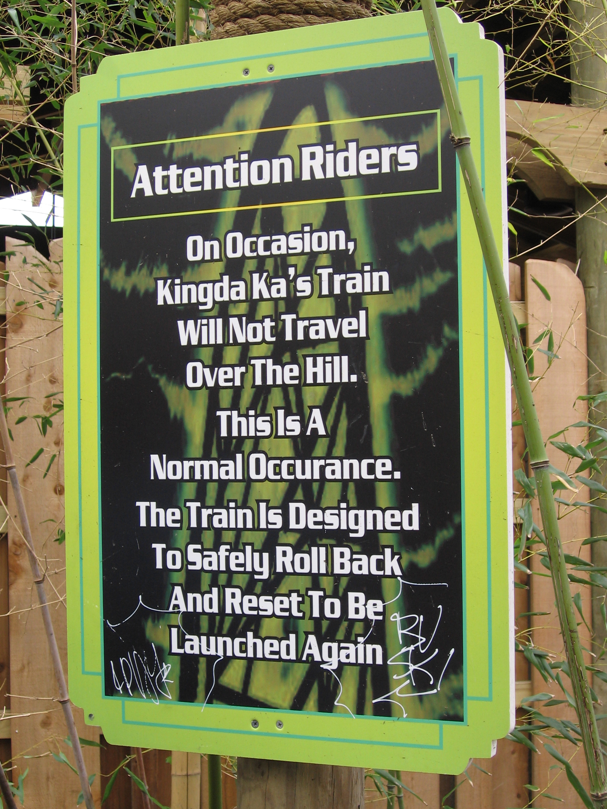

```{r setup, include=FALSE}
knitr::opts_chunk$set(echo = TRUE, error = FALSE)
```


# Kingda Ka


From Wikipedia: https://en.wikipedia.org/wiki/Kingda_Ka


Kingda Ka is a steel roller coaster located at Six Flags Great Adventure in Jackson, New Jersey. Designed by Werner Stengel and built by Intamin, the Accelerator Coaster model is the tallest roller coaster in the world and the second fastest. It is also the second strata coaster to open, which is a roller coaster that exceeds 400 feet (120 m) in height. Intamin subcontracted Stakotra to assist with its construction.[1] 
The train is launched by a hydraulic launch mechanism, accelerating to 128 miles per hour (206 km/h) in 3.5 seconds.[2] At the end of the launch track, the train climbs the main top hat tower, reaching a height of 456 feet (139 m), followed by a drop of 418 feet (127 m). Kingda Ka's track spans 3,118 feet (950 m) with a ride duration of 28 seconds.





The following link shows a video of what its like to sit in the front row during a ride: https://www.youtube.com/watch?v=HN8nv4tVFuA


In the video you may have noticed a sign that looks like this:




The following link shows a video of what its like to sit in the front row during a roll back. Skip to 0:56 of the video: https://www.youtube.com/watch?v=CHnlRFkakYc


*Discuss with the people around you why these roll backs occur and why the park has not fixed the problem*


## Investigation of Kingda Ka


The amount of horsepower that the Six Flags roller coaster Kingda Ka produces follows a Normal Model N(20800, 300). This means that the average Kingda Ka ride gets 20,800 horsepower with a standard deviation of 300 horsepower. Note that a typical car engine usually delivers only 128 horsepower!


1. Create a display of the normal distribution of Kingda Ka and label it.


```{r}
curve( dnorm(x, mean=20800, sd=300),
       xlim=c(20800 - 4*300, 20800 + 4*300), #pick your xlims by taking  mean - 4sd and mean +4sd
       main="Normal Distribution of Kingda Ka Horsepower",
       ylab="density")
```


2. Using the empirical rule (look back in your notes or look it up online if you forget it) what interval of horsepowers does the roller-coaster produce in the central 95% ?

*Answer*

```{r}
20800 - 2*300
20800 + 2*300
```


3. What is the amount of horsepower for which 95% of the rides produce less horsepower?

*Answer*

```{r}
qnorm(0.95, mean=20800, sd=300)
```


*Note that question 3 is very different from question 2. Question 2 asks for the central 95% while question 3 asks for the leftmost 95%.*


4. It takes at least 20127 horsepower to make it over the top and successfully complete the ride. Redraw the normal distribution but this time include a vertical red line from the x-axis to the curve at x= 20127. Make sure to title this diagram.


```{r}
curve( dnorm(x, mean=20800, sd=300),
       xlim=c(20800 - 4*300, 20800 + 4*300), #pick your xlims by taking  mean - 4sd and mean +4sd
       main="Normal Distribution of Kingda Ka Horsepower",
       ylab="density")

segments( 20127, 0,
          20127, dnorm(20127, mean=20800, sd=300), 
          #these are the coordinates (430,0) and (430, f(430) ) 
          col = "red",
          lwd = 4)
```

5. Given the information above, how often does the coaster fail to reach 20127 horsepower and instead roll back backwards?


*Answer*

```{r}
pnorm(20127, mean=20800, sd=300)
```


6. If Six Flags was to increase the amount of energy sent to the coaster such that the new mean was 21100 and the standard deviation remained at 300 how often would the coaster fail to make it over the top?


*Answer*

```{r}
pnorm(20127, mean=21100, sd=300)

```

7. If Six Flags was trying to save money by reducing the power such that the new mean was 20127 and the standard deviation remained at 300 how often would it fail to go over the top?

*Answer*

50%
```{r}
pnorm(20127, mean=20127, sd=300)
```

*Note that if you are understanding the excerise you should have been able to do 7 in your head without the help of R.*


8. If Six Flags replaced their power generators with more erratic ones such that the mean was still 20800 but the standard deviation was 500 would it fail more or less often? Try to answer this question without using R, just by thinking about it.

*Answer*

It would fail more often because 20127 would be closer in terms of standard deviations (smaller z-score) to the mean, meaning its percentile would be higher.

9. Now use R to answer question 8: If Six Flags replaced their power generators with more erratic ones such that the mean was still 20800 but the standard deviation was 500 would it fail to get over the top more or less often? What percent of the time would it roll back?

*Answer*
```{r}
pnorm(20127, mean=20800, sd=500)
```

10. For this question I want you to write your answer down without using R. If Six Flags bought more consistent but lower powered generators such that the new mean was 20400 and the new standard deviation is 50 would the coaster be more or less likely to make it over the top? How sure are you ? DO NOT DO THE CALCULATION YET!!! Just think about it and guess and explain.

*Answer*

It should be more likely to make it over the top because despite the new mean being lower, the standard deviation being a lot smaller means that 20127 would now be more standard deviations away from the mean (higher z-score), resulting in a lower percentile.

11. Do the calculation for question 10. Did the result match your guess in question 10?

*Answer*

```{r}
pnorm(20127, mean=20400, sd=50)
```

Yes, it did.

12. Using the original numbers ( mean = 20800, sd = 300 ) to generate a sample of 5000 random rides. Note: before knitting to PDF, please use the head() function around your code or comment it out so that it only prints a few values so you don't get an enormous PDF!

*Answer*

```{r}
five.thousand.rides = rnorm(5000, mean=20800, sd=300)
head(five.thousand.rides)
```
13. How many of those 5000 rides SHOULD have rolled back, according to our earlier calculations?

*Answer*

```{r}
5000*0.01243766
```
14. Optional Challenge: how many of the 5000 rides generated randomly ACTUALLY DID roll back?

*Answer*

```{r}
roll.back.rides = five.thousand.rides[five.thousand.rides < 20127]
length(roll.back.rides)
```


15. How much horsepower would need to be generated to put a ride in the 99.9th percentile?

*Answer*

```{r}
qnorm(0.999, mean=20800, sd=300)
```

16. How much horsepower would need to be generated to put a ride in the 10th percentile?

*Answer*
```{r}
qnorm(0.1, mean=20800, sd=300)
```


16. How often does Six Flags use more than enough energy to send Kinda Ka over the top?

*Answer*
```{r}
1 - pnorm(20127, mean=20800, sd=300)
```


